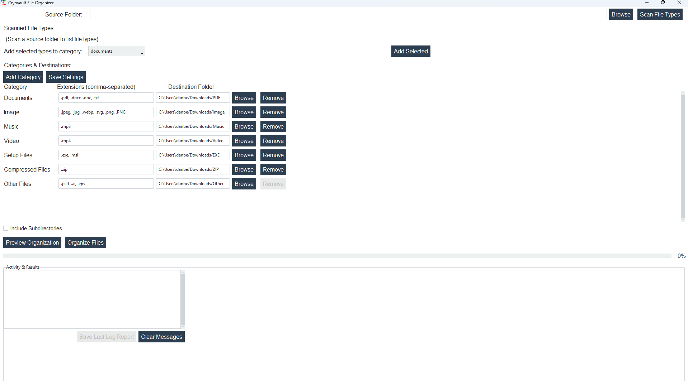

# ❄️ Cryovault | File Organizer Toolkit

Bring order to chaos with a clean, cross‑platform file organizer.  
Scan, categorize, and move files into vault‑like folders with ease.  
Built with **Python + Tkinter** (optional **ttkbootstrap** themes).



---

## ✨ Features
- 📁 Select a **source folder**, scan file types
- 🗂️ Create/manage **categories** and destinations
- 🔎 **Preview** organization to CSV before moving
- 🔀 **Organize** (move) files into per‑category destinations
- 📝 Export **CSV** logs
- 🎨 Uses `ttkbootstrap` if installed; otherwise falls back to standard ttk

---

## 🚀 Quick Start
```bash
python -m venv .venv
# Windows: .venv\Scripts\activate
# macOS/Linux: source .venv/bin/activate

pip install -r requirements.txt
# (optional) nicer themes
pip install ttkbootstrap

python main.py
```

---

## Options & Notes
- Works without ttkbootstrap — it’s optional.
- CSV preview filename: `cryovault_preview.csv`
- Log report default filename: `cryovault_log.csv`
- Config file: `cryovault_config.json`
- Log file: `cryovault.log`

---

## Packaging (Optional)
```bash
pip install pyinstaller
pyinstaller --noconfirm --onefile --windowed main.py
```
Builds appear in `dist/`.

---

## License
MIT — see LICENSE.
